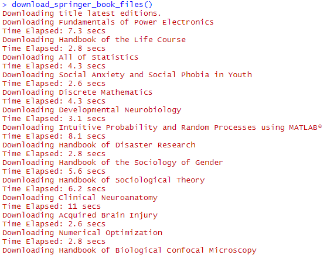

# `springerQuarantineBooksR`: download all Springer books made available during the COVID-19 quarantine

**"A range of essential textbooks from all disciplines will be freely available to support higher education institutions worldwide"**

Source: https://group.springernature.com/gp/group/media/press-releases/freely-accessible-textbook-initiative-for-educators-and-students/17858180?utm_medium=social&utm_content=organic&utm_source=facebook&utm_campaign=SpringerNature_&sf232256230=1

This package has the `generate_springer_book_files` function which can be used to generate all (or a subset) of these Springer book files freely available.

*This is still a work in progress. Thus, any help and/or feedbacks are welcome!*

## Installation

Having `devtools` installed and loaded, you can install `springerQuarantineBooksR` with the following code:

```
devtools::install_github("renanxcortes/springerQuarantineBooksR")
library(springerQuarantineBooksR)
```

## Download all books in any repo of your choice:

```
setwd('path_of_your_choice')

tic('Total time: ')
generate_springer_book_files()
toc()
```

You'll get an output just like below:



## Download only specific books:

If you'd like to download only Books related with "Data Science" on the title, for example, you can run:

```
books_list_url <- 'https://resource-cms.springernature.com/springer-cms/rest/v1/content/17858272/data/v4/'
GET(books_list_url, write_disk(tf <- tempfile(fileext = ".xlsx")))
springer_table <- read_excel(tf)

specific_titles_list <- springer_table %>% 
  filter(str_detect(`Book Title`, 'Data Science')) %>% 
  pull(`Book Title`)

generate_springer_book_files(specific_titles_list)
```

## Repo Structure generated


# Acknowledgments

This is an R version of the `springer_free_books` project available at https://github.com/alexgand/springer_free_books.

Thank you, Springer!