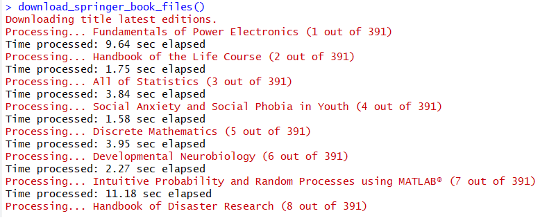

# `springerQuarantineBooksR`: download all Springer books made available during the COVID-19 quarantine

**"With the Coronavirus outbreak having an unprecedented impact on education, Springer Nature is launching a global program to support learning and teaching at higher education institutions worldwide."**

**Source:** https://group.springernature.com/gp/group/media/press-releases/freely-accessible-textbook-initiative-for-educators-and-students/17858180?utm_medium=social&utm_content=organic&utm_source=facebook&utm_campaign=SpringerNature_&sf232256230=1

This package has the `download_springer_book_files` function which can be used to download all (or a subset) of these Springer book files freely available. The default parameters download the latest pdf versions of the English books and generates a repo with 7.27GB.

An excellent blog post with some nice usage examples can be found at https://www.statsandr.com/blog/a-package-to-download-free-springer-books-during-covid-19-quarantine/.

*This is still a work in progress. Thus, any help and/or feedbacks are welcome!*

## Installation

Assuming you have [devtools](https://github.com/r-lib/devtools) installed, you can install `springerQuarantineBooksR` with the following code (you might also try `force = T` argument inside `install_github` function):

```
devtools::install_github("renanxcortes/springerQuarantineBooksR")
library(springerQuarantineBooksR)
```

## Download all books in any repo of your choice

```
setwd('path_of_your_choice')
download_springer_book_files()
```

You'll get an output similar like this:



## Repo Structure generated

It will be generated a repo named `springer_quarantine_books` with a specific structure:


## Download only specific books

For example, if you'd like to download only books with "Data Science" on the title, you can run:

```	
springer_table <- download_springer_table()

specific_titles_list <- springer_table %>% 
  filter(str_detect(book_title, 'Data Science')) %>% 
  pull(book_title)

download_springer_book_files(springer_books_titles = specific_titles_list)
```

## Download `.epub` extension of the books:

If you'd like to download the books in the `.epub` extension (alternatevely, you can download both by setting `filetype = 'both'`), you can run:

```
setwd('path_of_your_choice_for_epub_books')
download_springer_book_files(filetype = 'epub')
```

## Download books in German

If you'd like to download German books (more info in https://github.com/renanxcortes/springerQuarantineBooksR/issues/16), you can run:

```
setwd('path_of_your_choice_for_german_books')
download_springer_book_files(lan = 'ger')
```

# Acknowledgments

This project draw inspiration from the `springer_free_books` project available at https://github.com/alexgand/springer_free_books.

I also would like to thank @AntoineSoetewey for the constant help on feedbacks and spreading the package!

Thank you, Springer!
